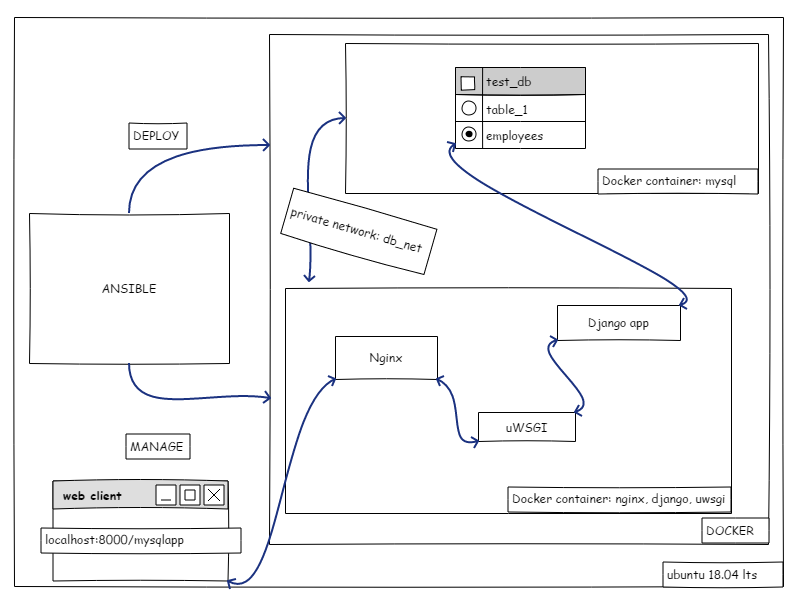

# simple-ansible-docker
This repo shows one of the ways to meet following conditions:

>Deploy a simple app that outputs the list of employees that are >Male which birth date is 1965-02-01 and the hire date is greater >than 1990-01-01 ordered by the Full Name of the employee.
>
>You will have to use Ubuntu 18.04 LTS as starting base and the solution needs to have the following items:
>
>- NGINX web server
>- Any programming language (PHP/Python/Perl/Whatever).
>- MySQL server
>- Configuration Management tool for configuring server (You can >?>use Saltstack/Ansible/Puppet/Chef, is allowed to use >modules/formulas/cookbooks from others so you don't reinvent the >wheel but please don't do copy&paste solutions or use things like >PuPHPet).

## idea
This is what wanted achieve:
```
the web client <-> the web server <-> uwsgi <-> Django
```


## requirements
* VM with Ubuntu 18.04 LTS

Well, that's all. You can use either Virtualbox or Vagrant.
There is one `mandatory requirement`, your VM needs to be connected to the internet.

I have tested it on VirtualBox 6.x.

-----
## how it works
Once you will get your clean Ubuntu 18.04 up and running, type:
```
sudo apt update && sudo apt install git
```
_no need to use sudo if you are root_

Next:
```
git clone https://github.com/gszulc/simple-ansible-docker.git
```
```
cd simple-ansible-docker/scripts
```
and:
```
chmod +x os_init.sh && sudo ./os_init.sh
```
Script will install some packages, including Ansible and Docker, configure Ansible and will deploy two docker images.

Once it's done, you can check following address in VM's browser:
```
localhost:8000/mysqlapp
```
-----
## what have been used
* docker image with mysql
* docker image with nginx, django and uwsgi
* ansible to build and run docker images
* django to run sql query and render output as html (using django-tables2)
* uwsgi - run the application, feed it requests from web clients (such as browsers) and return responses

-----
## todo
* use sockets for uwsgi <-> nginx
* add bootstrap for django templates
* dedicated mysql user: djangodb
* run inside docker (dind)

